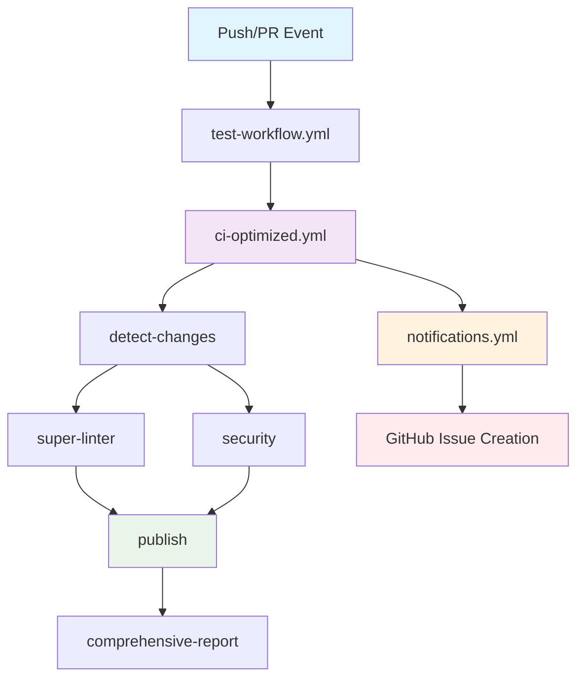

# Comprehensive CI/CD Pipeline with Documentation Publishing

1. **📊 Change Detection**: Analyzes which file types changed (docs, ansible, Python, workflows)
2. **🔍 Super Linter**: Runs intelligent linting with auto-fix capabilities (includes Ansible validation)
3. **🛡️ Security Scan**: Performs vulnerability scanning and secret detection
4. **🚀 Documentation Publishing**: Publishes docs to Confluence (main/release/hotfix branches only)
5. **📊 Comprehensive Report**: Generates detailed execution summary
6. **🚨 Failure Notifications**: Creates GitHub issues for any failures

## 📚 **Documentation**

📖 **[Complete Documentation](docs/INDEX.md)** - Start here for guides, setup, and usage instructions

🚀 **[Workflow Guide](docs/WORKFLOW_GUIDE.md)** - Main guide for using this CI/CD system

## 📁 Repository Dependencies

### What Your Repository Needs to Provide

The CI/CD pipeline is designed to work with **minimal dependencies** from your repository. Here's what you need:

#### For Basic CI/CD (Always Required):
```
your-repo/
├── .github/
│   └── workflows/
│       └── ci-cd.yml        # Your workflow that calls our pipeline
└── [your code files]        # Python, YAML, Ansible, etc.
```

#### For Documentation Publishing (Optional):
```
your-repo/
└── docs/
    ├── vars.yaml            # Variables and Confluence hierarchy config
    ├── *.j2                 # Jinja2 template files with YAML headers
    ├── *.md                 # Markdown files with YAML headers
    └── images/              # Images referenced in your documentation
        ├── diagram.png
        └── screenshot.jpg
```

### What We Automatically Provide

**No need to copy these to your repository** - our pipeline automatically handles:

```
redesigned-guacamole/
├── scripts/
│   ├── confluence_publisher.py     # ✅ Documentation publishing script
│   └── generate_sarif_summary.py   # ✅ Embedded in workflow
├── docs/
│   ├── macros.j2                   # ✅ Jinja2 macros for templates
│   └── macros/                     # ✅ Additional macro files
├── .github/workflows/
│   ├── ci-optimized.yml            # ✅ Main CI/CD pipeline
│   ├── publish-docs.yml            # ✅ Documentation publishing
│   └── notifications.yml           # ✅ Failure notifications
└── requirements.txt                # ✅ Python dependencies
```

### Documentation Template Example

Your `.j2` files should follow this structure:

```jinja2
---
# Metadata for Confluence Publishing
varsFile: "vars/aap.yml"
project_status: "In Review"

# Confluence Metadata
confluence:
  title: "My Document Title"
  space: "MYSPACE"
  category: "operations"  # Uses hierarchy from vars.yaml
  imageFolder: "docs/images"
---



# {{ organization_name }} Documentation

This document uses variables from vars.yaml like {{ organization_name }}
and macros provided by our pipeline.

{{ macros.info_box("This is an info box from our macro library") }}
```

### Key Benefits:

- ✅ **Zero Infrastructure Dependencies**: No need to copy our scripts or templates
- ✅ **Automatic Updates**: Pipeline improvements benefit all repositories immediately
- ✅ **Minimal Setup**: Only need your content and configuration
- ✅ **Centralized Maintenance**: All pipeline logic maintained in one place

## 📋 Workflows:

1. **📊 Change Detection**: Analyzes which file types changed (docs, ansible, Python, workflows)
2. **🔍 Super Linter**: Runs intelligent linting with auto-fix capabilities (includes Ansible validation)
3. **🛡️ Security Scan**: Performs vulnerability scanning and secret detection
4. **🚀 Documentation Publishing**: Publishes docs to Confluence (main/release/hotfix branches only)
5. **📊 Comprehensive Report**: Generates detailed execution summary
6. **🚨 Failure Notifications**: Creates GitHub issues for any failureslow.svg)](https://opensource.org/license/MIT)
[](https://www.python.org/downloads/)
[](https://github.com/features/actions)
[](https://www.atlassian.com/software/confluence)

A **comprehensive reusable GitHub Actions CI/CD pipeline** that provides automated code quality checks, security scanning, and documentation publishing to Confluence for any repository.

## 🎯 Purpose

This repository provides **reusable workflows** that any other repository can call to:
- � **Intelligent Code Analysis**: Dynamic Super Linter with auto-fix capabilities
- 🛡️ **Security Scanning**: DevSkim, Trivy vulnerability scanning, and secret detection
- 🎭 **Ansible Validation**: Comprehensive Ansible syntax checking and linting (integrated with Super Linter)
- � **Documentation Publishing**: Process and publish documentation to Confluence
- 🚨 **Failure Notifications**: Automatic GitHub issue creation for CI/CD failures
- 📊 **Comprehensive Reporting**: SARIF output and detailed execution summaries

## 🚀 Quick Start for Remote Repositories

### 1. Add CI/CD Pipeline to Your Repository

Create `.github/workflows/ci-cd.yml` in your repository:

```yaml
name: � CI/CD Pipeline

on:
  push:
    branches:
      - main
      - develop
      - 'feature/**'
      - 'release/**'
      - 'hotfix/**'
  pull_request:
    branches: [main, develop]
  workflow_dispatch:
    inputs:
      full_scan:
        description: 'Run full codebase scan'
        type: boolean
        default: true

permissions:
  contents: read
  packages: read
  statuses: write
  security-events: write
  actions: read

jobs:
  ci-cd-pipeline:
    uses: YOUR_USERNAME/YOUR_REPOSITORY/.github/workflows/ci-optimized.yml@main
    with:
      full_scan: ${{ inputs.full_scan || true }}
      branch_name: ${{ github.ref_name }}
    secrets:
      CONFLUENCE_URL: ${{ secrets.CONFLUENCE_URL }}
      CONFLUENCE_USER: ${{ secrets.CONFLUENCE_USER }}
      CONFLUENCE_API_TOKEN: ${{ secrets.CONFLUENCE_API_TOKEN }}
```

### 2. Set Up Repository Secrets

In your repository settings → Secrets and variables → Actions, add:
- `CONFLUENCE_URL`: Your Confluence base URL (e.g., `https://company.atlassian.net`)
- `CONFLUENCE_USER`: Your Confluence username/email
- `CONFLUENCE_API_TOKEN`: Your Confluence API token

### 3. Configure Your Repository Structure

The pipeline works with various project types and will automatically detect and validate:

```
your-repo/
├── docs/                     # Documentation files (if any)
│   ├── *.md                 # Markdown files
│   ├── *.j2                 # Jinja2 templates
│   └── vars.yaml            # Template variables
├── playbooks/               # Ansible playbooks (if any)
├── roles/                   # Ansible roles (if any)
├── **/*.py                  # Python files
├── **/*.yml                 # YAML files
├── **/*.yaml                # YAML files
├── **/*.sh                  # Shell scripts
└── .github/
    └── workflows/
        └── ci-cd.yml        # Your CI/CD workflow
```

## 🔄 Workflow Execution Flow

Here's how the complete workflow executes:



### Detailed Execution Flow:

1. **� Change Detection**: Analyzes which file types changed (docs, ansible, Python, workflows)
2. **🔍 Super Linter**: Runs intelligent linting with auto-fix capabilities
3. **🛡️ Security Scan**: Performs vulnerability scanning and secret detection
4. **🎭 Ansible Syntax Check**: Validates Ansible playbooks and roles (if present)
5. **🚀 Documentation Publishing**: Publishes docs to Confluence (main/release/hotfix branches only)
6. **📊 Comprehensive Report**: Generates detailed execution summary
7. **🚨 Failure Notifications**: Creates GitHub issues for any failures

## 📋 Available Workflows

### 1. Main CI/CD Pipeline (`ci-optimized.yml`)

**Purpose**: Complete CI/CD pipeline with code quality, security, and documentation publishing

**Triggers**: Called by remote repositories via `workflow_call`

**Inputs**:
- `full_scan` (boolean): Run full codebase scan vs. changed files only (default: true)
- `branch_name` (string): Branch name to checkout (default: '')

**Secrets**:
- `CONFLUENCE_URL`: Confluence base URL (optional)
- `CONFLUENCE_USER`: Confluence username (optional)
- `CONFLUENCE_API_TOKEN`: Confluence API token (optional)

**Jobs**:
- `detect-changes`: Analyzes file changes for optimized execution
- `super-linter`: Intelligent linting with auto-fix capabilities (includes Ansible validation)
- `security`: DevSkim, Trivy, and secret detection
- `publish`: Documentation publishing to Confluence
- `comprehensive-report`: Detailed execution summary

### 2. Documentation Publishing (`publish-docs.yml`)

**Purpose**: Standalone documentation publishing workflow

**Inputs**:
- `dry_run` (boolean): Run without actual publishing (default: false)
- `target_environment` (string): Target environment (default: 'production')

**Secrets**:
- `CONFLUENCE_URL`: Confluence base URL
- `CONFLUENCE_USER`: Confluence username
- `CONFLUENCE_API_TOKEN`: Confluence API token

### 3. Failure Notifications (`notifications.yml`)

**Purpose**: Automatically create GitHub issues when CI/CD pipeline fails

**Triggers**: Runs after "🚀 CI/CD Pipeline" workflow completion
- Only triggers on failure or non-success status
- Prevents duplicate issues for the same failure type
- Provides detailed troubleshooting information
```

## 📝 File Format Examples

### Markdown File with Frontmatter

```markdown
---
confluence:
  space_key: "DOCS"
  title: "Getting Started Guide"
  parent_page_id: "789012"
---

# Getting Started

Welcome to our documentation...
```

### Jinja2 Template

```jinja2
---
confluence:
  space_key: "DOCS"
  title: "{{ project_name }} Deployment Guide"
  parent_page_id: "345678"
---

# {{ project_name }} Deployment Guide

Environment: {{ environment }}
Version: {{ version }}

## Prerequisites

...
```

## 🔧 Available Workflows

### 1. Documentation Publishing (`publish-docs.yml`)

**Purpose**: Process and publish documentation to Confluence

**Inputs**:
- `dry_run` (boolean): Run without actual publishing (default: false)
- `target_environment` (string): Target environment (default: 'production')

**Secrets**:
- `CONFLUENCE_URL`: Confluence base URL
- `CONFLUENCE_USER`: Confluence username
- `CONFLUENCE_API_TOKEN`: Confluence API token

### 2. CI/CD Pipeline (`ci-optimized.yml`)

**Purpose**: Comprehensive CI/CD pipeline with linting, security, and documentation publishing

**Inputs**:
- `full_scan` (boolean): Run full codebase scan (default: true)
- `branch_name` (string): Branch to checkout

## 🛠️ Local Development

If you want to contribute to this repository or run components locally:

```bash
# Clone the repository
git clone https://github.com/YOUR_USERNAME/YOUR_REPOSITORY.git
cd YOUR_REPOSITORY

# Install dependencies
pip install -r requirements.txt

# Test the documentation publisher locally
python scripts/confluence_publisher.py
  --dry-run
  --docs-dir docs
  --vars-file docs/vars.yaml

# Run local linting
python -m py_compile scripts/*.py
yamllint .
# Note: ansible-lint is now handled by Super Linter in CI/CD
```

## 📋 Requirements

## �� Support

- 📖 Check the [examples](docs/) in this repository
- 🐛 [Open an issue](https://github.com/YOUR_USERNAME/YOUR_REPOSITORY/issues) for bugs
- 💡 [Request features](https://github.com/YOUR_USERNAME/YOUR_REPOSITORY/discussions) via discussions
- 📚 Review workflow logs in GitHub Actions for detailed debugging

## 📄 License

This project is licensed under the MIT License - see the [LICENSE](LICENSE) file for details.

---

**Maintained by**: [Khalil Gibrotha](https://github.com/KhalilGibrotha)
**Created**: January 2025
**License**: MIT

**🚀 Ready to add comprehensive CI/CD to your repository? Start with the Quick Start guide above! 🎯**
