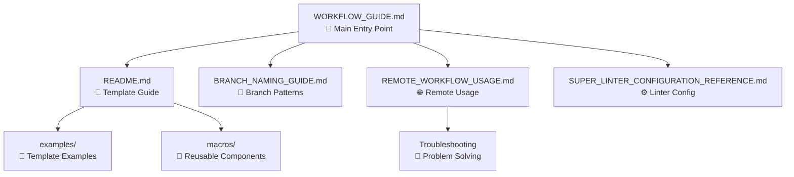

# 📚 Documentation Index

Welcome to the Redesigned Guacamole documentation! This directory contains all the guides and references you need to use this CI/CD workflow system.

## 🚀 **Getting Started**

### New to This Repository?
Start here: **[WORKFLOW_GUIDE.md](WORKFLOW_GUIDE.md)** - Complete overview of features, setup, and usage

### Using Templates?
Read this: **[README.md](README.md)** - Comprehensive Jinja2 template documentation

## 📖 **Core Documentation**

| Document | Purpose | Audience |
|----------|---------|----------|
| **[WORKFLOW_GUIDE.md](WORKFLOW_GUIDE.md)** | Complete CI/CD workflow guide | All users |
| **[README.md](README.md)** | Jinja2 template documentation | Template creators |
| **[BRANCH_NAMING_GUIDE.md](BRANCH_NAMING_GUIDE.md)** | Branch naming patterns | Developers |
| **[REMOTE_WORKFLOW_USAGE.md](REMOTE_WORKFLOW_USAGE.md)** | Remote usage & troubleshooting | External repository users |
| **[SUPER_LINTER_CONFIGURATION_REFERENCE.md](SUPER_LINTER_CONFIGURATION_REFERENCE.md)** | Linter configuration reference | Configuration managers |

## 🎯 **Quick Navigation**

### I want to...

**🔧 Use this workflow in my repository**
→ [WORKFLOW_GUIDE.md - Remote Usage Guide](WORKFLOW_GUIDE.md#-remote-usage-guide)

**📄 Create documentation templates**  
→ [README.md - Template Guide](README.md)

**🌿 Understand branch naming**
→ [BRANCH_NAMING_GUIDE.md](BRANCH_NAMING_GUIDE.md)

**🐛 Troubleshoot workflow issues**
→ [REMOTE_WORKFLOW_USAGE.md - Troubleshooting](REMOTE_WORKFLOW_USAGE.md#troubleshooting)

**⚙️ Configure linting rules**
→ [SUPER_LINTER_CONFIGURATION_REFERENCE.md](SUPER_LINTER_CONFIGURATION_REFERENCE.md)

**🧪 See template examples**
→ [examples/](examples/) directory

## 📁 **Directory Structure**

```
docs/
├── INDEX.md                                    # This file
├── WORKFLOW_GUIDE.md                           # 🚀 Main guide (START HERE)
├── README.md                                   # 📄 Template documentation  
├── BRANCH_NAMING_GUIDE.md                      # 🌿 Branch naming reference
├── REMOTE_WORKFLOW_USAGE.md                    # 🌐 Remote usage guide
├── SUPER_LINTER_CONFIGURATION_REFERENCE.md     # ⚙️ Linter configuration
├── examples/                                   # 🧪 Example templates
│   ├── cool-test-feature.md                   # Feature documentation example
│   └── image-test.md                          # Image handling example
├── aap_operations_manual.j2                   # 📋 Operations template
├── aap_platform_admin_guide.j2                # 🔧 Admin guide template
├── aap_policy_governance.j2                   # 📜 Policy template
├── vars.yaml                                  # 📊 Template variables
├── macros/                                    # 🧩 Jinja2 macros
└── images/                                    # 🖼️ Image assets
```

## 🔄 **Document Relationships**



## 🎯 **Documentation Quality**

| Document | Completeness | Maintenance | Target Audience |
|----------|--------------|-------------|-----------------|
| WORKFLOW_GUIDE.md | ⭐⭐⭐⭐⭐ | Current | All users |
| README.md | ⭐⭐⭐⭐⭐ | Current | Template creators |
| BRANCH_NAMING_GUIDE.md | ⭐⭐⭐⭐⭐ | Current | Developers |
| REMOTE_WORKFLOW_USAGE.md | ⭐⭐⭐⭐ | Current | External users |
| SUPER_LINTER_CONFIGURATION_REFERENCE.md | ⭐⭐⭐⭐ | Current | Config managers |

## 🚀 **Next Steps**

1. **First Time Here?** → Start with [WORKFLOW_GUIDE.md](WORKFLOW_GUIDE.md)
2. **Setting Up Remote Usage?** → Jump to [REMOTE_WORKFLOW_USAGE.md](REMOTE_WORKFLOW_USAGE.md)
3. **Creating Templates?** → Read [README.md](README.md)
4. **Need Examples?** → Browse [examples/](examples/)

---

**📞 Need Help?** Each document includes troubleshooting sections and support information.
