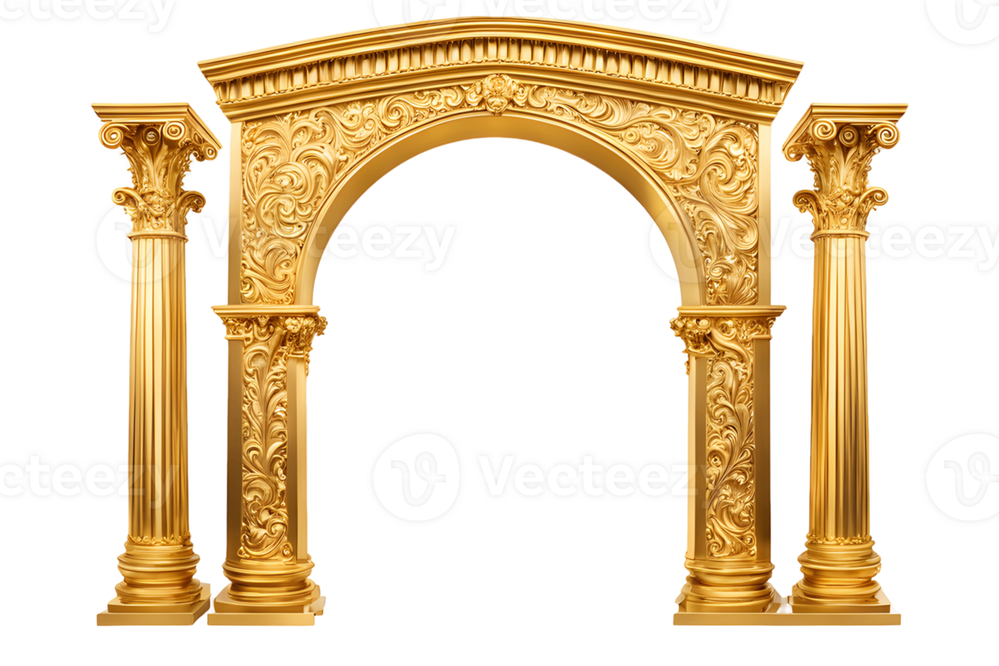

---
confluence:
  space: "AH"
  title: "Image Test Documentation"
  category: "testing"  # Uses hierarchy: testing -> root
---

# Image Test Documentation

This document tests image functionality with the Confluence publisher.

## Architecture Diagram (PNG)

Here's our architecture diagram in PNG format:

## Architecture Diagram (WebP)

Same diagram in WebP format:

## HTML Image Tag

You can also use HTML img tags:

## Supported Image Formats

The publisher supports these image formats:
- ✅ PNG (.png)
- ✅ JPEG (.jpg, .jpeg) 
- ✅ GIF (.gif)
- ✅ WebP (.webp)
- ✅ BMP (.bmp)
- ✅ SVG (.svg)
- ✅ TIFF (.tiff, .tif)

## Features

- ✅ Automatically uploads images as Confluence attachments
- ✅ Updates content to reference uploaded attachments  
- ✅ Works with both Markdown and HTML image syntax
- ✅ Handles relative and absolute paths
- ✅ Preserves image dimensions when specified
