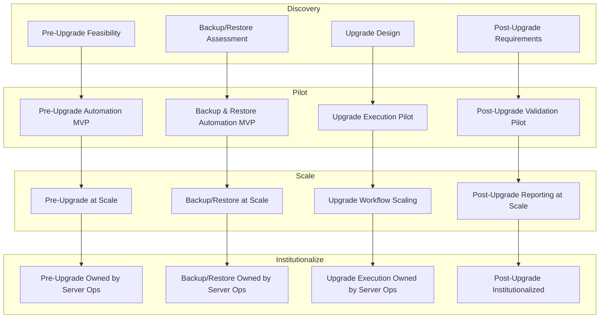

# Windows Server Upgrade Automation – Combined Delivery & Maturity Model

**Author:** Solutions Architecture – Platform Engineering
**Program:** Windows Server Upgrade Automation
**Date:** October 2025

---

## 1. Overview

This document describes the **combined delivery and maturity model** for the Windows Server In-Place Upgrade Automation program.
It aligns the functional delivery milestones (Pre-Upgrade, Backup/Restore, Upgrade, and Post-Upgrade) with the SVP’s strategic automation implementation phases:
**Discovery → Pilot → Scale → Institutionalize.**

From a solutions architecture perspective, this approach ensures:

* Iterative delivery of automation capabilities (functional progress).
* Measurable maturity of adoption and ownership (organizational progress).
* Controlled handoffs between **Platform Engineering** and **Server Operations** with accountability at every milestone.

This dual model makes automation progress tangible to leadership while maintaining agility for engineering teams.

---

## 2. Combined Model: Functional Delivery × Strategic Phases

| Functional Delivery   | Discovery                                              | Pilot                                                   | Scale                                            | Institutionalize                                    |
| --------------------- | ------------------------------------------------------ | ------------------------------------------------------- | ------------------------------------------------ | --------------------------------------------------- |
| **Pre-Upgrade**       | Define feasibility, connectivity, inventory structure. | Develop and test automation for pre-checks.             | Expand automation to all environments.           | Server Ops owns and documents process.              |
| **Backup & Restore**  | Identify backup dependencies and APIs.                 | Develop automation for backup/restore validation.       | Integrate with VMware and Commvault at scale.    | Server Ops incorporates automation into SOP.        |
| **Upgrade Execution** | Assess ISO handling and credentials.                   | Pilot upgrade playbook with CCP integration.            | Expand to production-like systems.               | Ops performs upgrades using automation as standard. |
| **Post-Upgrade**      | Identify validation and reporting needs.               | Develop post-upgrade patching and reporting automation. | Integrate logging and reporting into AAP/Splunk. | Ops runs post-upgrade checks as part of process.    |

---

## 3. Delivery Flow Visualization

The following diagram illustrates the **cross-functional progression** of each automation component as it matures through the four phases of delivery and adoption.

---

## 4. Architectural Intent

From a solutions architect’s standpoint, this combined approach:

* **Supports Iterative Value Delivery:**  Each function delivers tangible outcomes (e.g., pre-check automation) that can be tested and adopted before the full program completes.
* **Builds Organizational Readiness:**  Every phase concludes with a formal handoff where Server Ops validates automation, updates documentation, and integrates into daily operations.
* **Maintains Governance Alignment:**  Each phase corresponds to the SVP’s automation model, ensuring all efforts are tracked under consistent metrics and reporting.
* **Enables Continuous Improvement:**  Feedback from each handoff informs the next function’s discovery and pilot efforts, sustaining a learning loop between teams.

---

## 5. Handoff and Validation Framework

At the completion of each function’s phase:

1. **Platform Engineering** delivers tested automation to **Server Operations**.
2. **Server Operations** executes pilot runs and integrates automation into their upgrade documentation.
3. A **joint validation** meeting records outcomes, lessons learned, and next-phase readiness.
4. Leadership receives a summarized report with success metrics, risks, and upcoming milestones.

This model enforces both engineering rigor and process accountability, ensuring that automation becomes an integral part of day-to-day operations rather than a parallel initiative.

---

## 6. Summary

This combined model bridges the technical and organizational aspects of automation delivery. It communicates clearly to both engineers and leadership:

* **To engineers:** Each functional automation track can move independently and deliver usable results.
* **To leadership:** All progress is governed and measured under the established four-phase automation lifecycle.

The result is a scalable, transparent, and sustainable method for embedding automation into enterprise operations.

---

**Maintained by:** SEO Platform Engineering – Architecture & Automation Strategy
**Version:** Draft v1.0
**Last Updated:** October 2025
